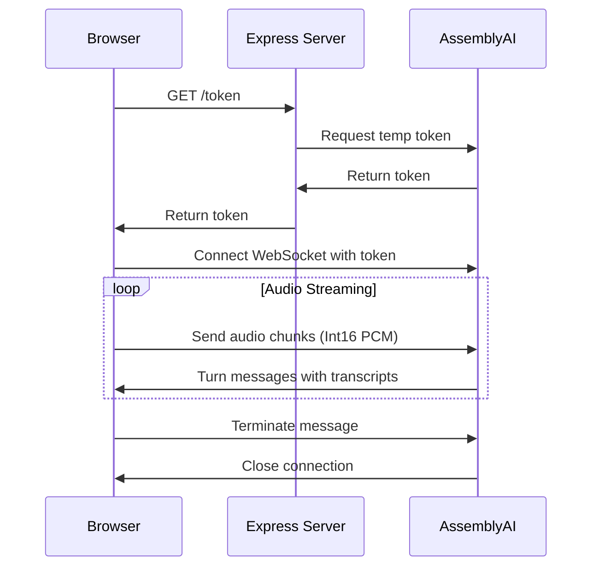

## Overview

The AssemblyAI Real-Time Transcription Browser Example uses a three-tier architecture that separates concerns between the backend server, frontend client, and AssemblyAI's streaming service.

## Architecture Components

### 1. Express Server (Backend)

The Express server acts as a security layer and token provider:

```javascript server.js
const express = require("express");
const path = require("path");
const { generateTempToken } = require("./tokenGenerator");

const app = express();
const PORT = 8000;

app.use(express.static(path.join(__dirname, "public")));

app.get("/token", async (req, res) => {
  try {
    const token = await generateTempToken(60);
    res.json({ token });
  } catch (error) {
    res.status(500).json({ error: "Failed to generate token" });
  }
});
```

<Info>
The server's primary responsibility is generating temporary tokens for secure client-side connections to AssemblyAI. It never exposes your API key to the browser.
</Info>

### 2. Browser Client (Frontend)

The client handles three main responsibilities:

- **Audio capture** using the Web Audio API and AudioWorklet
- **Token retrieval** from the Express server
- **WebSocket communication** with AssemblyAI's real-time service

```javascript index.js
async function run() {
  microphone = createMicrophone();
  await microphone.requestPermission();

  // Get temporary token from server
  const response = await fetch("http://localhost:8000/token");
  const data = await response.json();

  // Connect to AssemblyAI with token
  const endpoint = `wss://streaming.assemblyai.com/v3/ws?sample_rate=16000&formatted_finals=true&token=${data.token}`;
  ws = new WebSocket(endpoint);
}
```

### 3. AssemblyAI Streaming Service

The AssemblyAI service receives audio data over WebSocket and returns transcripts in real-time using turn-based messages.

## Data Flow



## Turn-Based Transcription

AssemblyAI returns transcripts as "turns" - natural speech segments organized by speaker turns:

```javascript index.js
const turns = {}; // keyed by turn_order

ws.onmessage = (event) => {
  const msg = JSON.parse(event.data);
  if (msg.type === "Turn") {
    const { turn_order, transcript } = msg;
    turns[turn_order] = transcript;

    // Display turns in order
    const orderedTurns = Object.keys(turns)
      .sort((a, b) => Number(a) - Number(b))
      .map((k) => turns[k])
      .join(" ");

    messageEl.innerText = orderedTurns;
  }
};
```

<Note>
Turns may arrive out of order due to network conditions or processing delays. The application stores turns in an object and sorts them by `turn_order` for display.
</Note>

## Security Architecture

<Tip>
By using temporary tokens generated server-side, your AssemblyAI API key never leaves the server. This prevents unauthorized access even if the client code is compromised.
</Tip>

The token-based security model ensures:

1. API keys remain secret on the server
2. Clients receive time-limited access tokens
3. Tokens expire automatically (60 seconds in this example)
4. Each client session requires a new token

## Connection Lifecycle

1. **Initialization**: User clicks "Record" button
2. **Token Request**: Client fetches temporary token from Express server
3. **WebSocket Connection**: Client connects to AssemblyAI using token
4. **Audio Streaming**: AudioWorklet processes and sends audio chunks
5. **Transcription**: AssemblyAI returns Turn messages with transcripts
6. **Termination**: User clicks "Stop", client sends Terminate message and closes connection

<Info>
The application maintains state through boolean flags (`isRecording`) and object references (`ws`, `microphone`) to coordinate between components.
</Info>