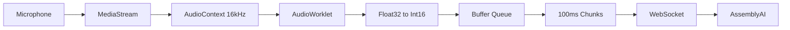

## Overview

The application uses the Web Audio API's AudioWorklet to process microphone audio in real-time. The AudioWorklet runs on a separate thread, converting Float32 audio samples to Int16 PCM format at 16kHz sample rate.

## AudioWorklet Implementation

The AudioWorklet processor handles the core audio conversion:

```javascript audio-processor.js
const MAX_16BIT_INT = 32767

class AudioProcessor extends AudioWorkletProcessor {
  process(inputs) {
    try {
      const input = inputs[0]
      if (!input) throw new Error('No input')

      const channelData = input[0]
      if (!channelData) throw new Error('No channelData')

      const float32Array = Float32Array.from(channelData)
      const int16Array = Int16Array.from(
        float32Array.map((n) => n * MAX_16BIT_INT)
      )
      const buffer = int16Array.buffer
      this.port.postMessage({ audio_data: buffer })

      return true
    } catch (error) {
      console.error(error)
      return false
    }
  }
}

registerProcessor('audio-processor', AudioProcessor)
```

<Info>
The AudioWorklet runs on the audio rendering thread, separate from the main JavaScript thread. This ensures consistent, low-latency audio processing without blocking the UI.
</Info>

## Audio Format Conversion

### Float32 to Int16 Conversion

Browser audio is captured as Float32 values ranging from -1.0 to 1.0. AssemblyAI requires Int16 PCM format with values from -32768 to 32767:

```javascript
const float32Array = Float32Array.from(channelData)
const int16Array = Int16Array.from(
  float32Array.map((n) => n * MAX_16BIT_INT)
)
```

<Note>
`MAX_16BIT_INT` is set to 32767 (the maximum positive value for a signed 16-bit integer). Multiplying Float32 values by this constant converts the -1.0 to 1.0 range into the Int16 range.
</Note>

### Sample Rate Configuration

The AudioContext is configured for 16kHz sample rate, which AssemblyAI's real-time service expects:

```javascript index.js
audioContext = new AudioContext({
  sampleRate: 16000,
  latencyHint: 'balanced'
});
```

<Tip>
The `latencyHint: 'balanced'` setting provides a good compromise between latency and audio quality for real-time transcription use cases.
</Tip>

## Buffering Strategy

The client implements a buffering system to send audio chunks at regular intervals:

```javascript index.js
let audioBufferQueue = new Int16Array(0);

audioWorkletNode.port.onmessage = (event) => {
  const currentBuffer = new Int16Array(event.data.audio_data);
  audioBufferQueue = mergeBuffers(audioBufferQueue, currentBuffer);

  const bufferDuration = (audioBufferQueue.length / audioContext.sampleRate) * 1000;

  if (bufferDuration >= 100) {
    const totalSamples = Math.floor(audioContext.sampleRate * 0.1);
    const finalBuffer = new Uint8Array(audioBufferQueue.subarray(0, totalSamples).buffer);
    audioBufferQueue = audioBufferQueue.subarray(totalSamples);

    if (onAudioCallback) onAudioCallback(finalBuffer);
  }
};
```

### Why Buffer Audio?

1. **Network Efficiency**: Sending larger chunks reduces WebSocket message overhead
2. **Consistent Timing**: 100ms chunks provide predictable data flow
3. **Processing Optimization**: AssemblyAI can process larger chunks more efficiently

<Info>
The buffer accumulates audio until it reaches 100ms duration (1,600 samples at 16kHz). This balances latency with efficiency.
</Info>

## Buffer Merging

The `mergeBuffers` function combines incoming audio with the existing queue:

```javascript index.js
function mergeBuffers(lhs, rhs) {
  const merged = new Int16Array(lhs.length + rhs.length);
  merged.set(lhs, 0);
  merged.set(rhs, lhs.length);
  return merged;
}
```

<Note>
This creates a new Int16Array and copies both buffers into it. While not the most memory-efficient approach, it's simple and works well for real-time audio streaming.
</Note>

## Audio Pipeline



## Key Calculations

### Buffer Duration
```javascript
const bufferDuration = (audioBufferQueue.length / audioContext.sampleRate) * 1000;
```
Divides the number of samples by sample rate (16000) and converts to milliseconds.

### Samples per Chunk
```javascript
const totalSamples = Math.floor(audioContext.sampleRate * 0.1);
```
Calculates 100ms worth of samples: 16000 samples/sec × 0.1 sec = 1,600 samples.

## Cleanup

When recording stops, all audio resources are properly released:

```javascript index.js
stopRecording() {
  stream?.getTracks().forEach((track) => track.stop());
  audioContext?.close();
  audioBufferQueue = new Int16Array(0);
}
```

<Tip>
Always close the AudioContext and stop media tracks to free system resources and prevent memory leaks.
</Tip>