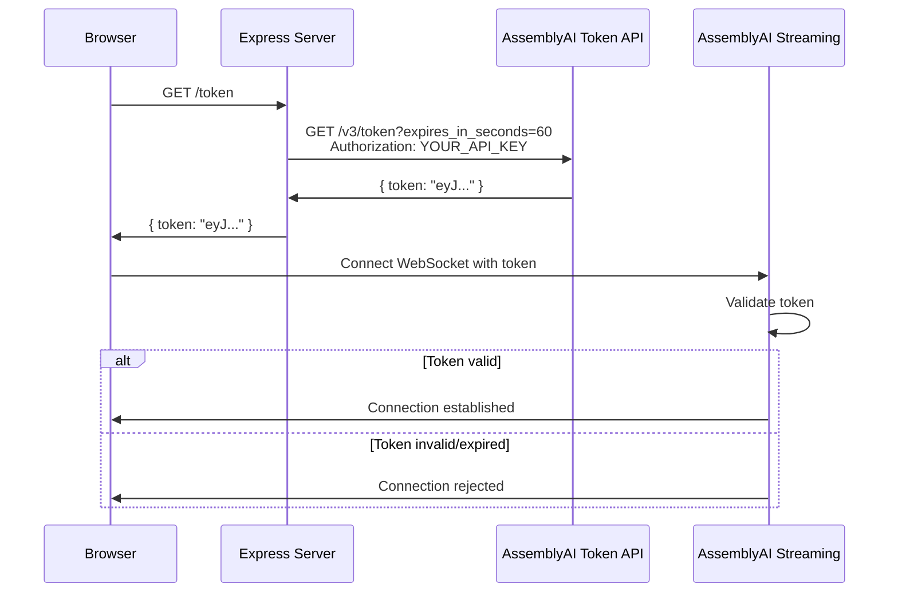

## Overview

The application uses temporary tokens instead of exposing your AssemblyAI API key directly in the browser. This security model protects your credentials while enabling client-side real-time transcription.

## Why Temporary Tokens?

Exposing API keys in browser JavaScript creates serious security risks:

<Note>
**Security Risks of Client-Side API Keys**
- Keys are visible in browser DevTools and page source
- Keys can be extracted and used by unauthorized parties
- Compromised keys require rotation and updating all deployments
- No way to revoke access for individual users or sessions
</Note>

Temporary tokens solve these problems by:

1. **Time-Limited Access**: Tokens expire automatically (configurable from 1 to 600 seconds)
2. **Single-Use**: Each browser session gets a fresh token
3. **Revocable**: Expired tokens are immediately invalid
4. **Zero Key Exposure**: Your API key never leaves the server

<Tip>
Temporary tokens follow the principle of least privilege - granting only the minimum access needed for the specific task.
</Tip>

## Server-Side Token Generation

The Express server generates tokens using AssemblyAI's token endpoint:

```javascript tokenGenerator.js
const axios = require('axios');
require("dotenv").config();

async function generateTempToken(expiresInSeconds) {
  const url = `https://streaming.assemblyai.com/v3/token?expires_in_seconds=${expiresInSeconds}`;

  try {
    const response = await axios.get(url, {
      headers: {
        Authorization: process.env.ASSEMBLYAI_API_KEY,
      },
    });
    return response.data.token;
  } catch (error) {
    console.error("Error generating temp token:", error.response?.data || error.message);
    throw error;
  }
}

module.exports = { generateTempToken };
```

<Info>
The API key is stored in the `.env` file and accessed via `process.env.ASSEMBLYAI_API_KEY`. It's sent to AssemblyAI's token endpoint but never transmitted to the browser.
</Info>

## Token Expiration

Tokens are generated with a configurable expiration time:

```javascript server.js
app.get("/token", async (req, res) => {
  try {
    const token = await generateTempToken(60); // Max value 600
    res.json({ token });
  } catch (error) {
    res.status(500).json({ error: "Failed to generate token" });
  }
});
```

<Note>
This example uses a 60-second expiration. The maximum allowed value is 600 seconds (10 minutes). Choose a duration that balances security with user experience.
</Note>

### Choosing an Expiration Time

- **Short durations (60-120s)**: Better security, but may interrupt long conversations
- **Medium durations (180-300s)**: Good balance for most use cases
- **Long durations (300-600s)**: Better UX, but tokens are valid longer if leaked

<Tip>
For production applications, consider implementing token refresh logic to extend sessions without interrupting the user experience.
</Tip>

## Client-Side Token Usage

The browser requests a token before establishing the WebSocket connection:

```javascript index.js
async function run() {
  // ... microphone setup ...

  // Request token from server
  const response = await fetch("http://localhost:8000/token");
  const data = await response.json();
  if (data.error || !data.token) {
    alert("Failed to get temp token");
    return;
  }

  // Use token in WebSocket URL
  const endpoint = `wss://streaming.assemblyai.com/v3/ws?sample_rate=16000&formatted_finals=true&token=${data.token}`;
  ws = new WebSocket(endpoint);
}
```

<Info>
The token is passed as a query parameter in the WebSocket URL. AssemblyAI validates the token when the connection is established.
</Info>

## Token Lifecycle



## Token Validation

AssemblyAI validates tokens when:

1. **WebSocket Connection**: Token is checked when the connection is established
2. **During Streaming**: If a token expires mid-session, the connection is closed

<Note>
If a connection is closed due to token expiration, the `ws.onclose` handler will fire. The application would need to request a new token and reconnect.
</Note>

## Error Handling

The token generation endpoint includes error handling:

```javascript server.js
app.get("/token", async (req, res) => {
  try {
    const token = await generateTempToken(60);
    res.json({ token });
  } catch (error) {
    res.status(500).json({ error: "Failed to generate token" });
  }
});
```

Common errors:

- **Invalid API Key**: Check that your `.env` file contains the correct key
- **Network Issues**: AssemblyAI's token endpoint may be unreachable
- **Rate Limiting**: Too many token requests in a short time

<Tip>
Always handle token request failures gracefully. Display clear error messages to users and log detailed errors for debugging.
</Tip>

## Security Best Practices

<Tip>
**API Key Storage**
- Store API keys in `.env` files
- Never commit `.env` files to version control
- Add `.env` to your `.gitignore`
- Use environment variables in production
</Tip>

<Tip>
**Token Management**
- Use the shortest practical expiration time
- Generate a new token for each session
- Don't cache tokens on the client
- Validate token requests server-side
</Tip>

<Tip>
**Production Considerations**
- Implement rate limiting on your `/token` endpoint
- Add authentication/authorization for your users
- Consider implementing token refresh logic
- Monitor token generation for unusual patterns
</Tip>

## Environment Variables

The `.env` file should contain your AssemblyAI API key:

```bash .env
ASSEMBLYAI_API_KEY=your_api_key_here
```

<Info>
Get your API key from the [AssemblyAI dashboard](https://www.assemblyai.com/dashboard). Never share or commit this key.
</Info>

## Token Request Flow

1. **User Clicks Record**: Triggers the `run()` function
2. **Client Requests Token**: `fetch("http://localhost:8000/token")`
3. **Server Validates Request**: Express endpoint receives the request
4. **Server Generates Token**: Calls AssemblyAI's token API with your API key
5. **Server Returns Token**: Sends token back to client as JSON
6. **Client Connects**: Uses token in WebSocket URL to connect to AssemblyAI

<Note>
This flow ensures your API key is only used server-side, where it's protected from client-side extraction.
</Note>